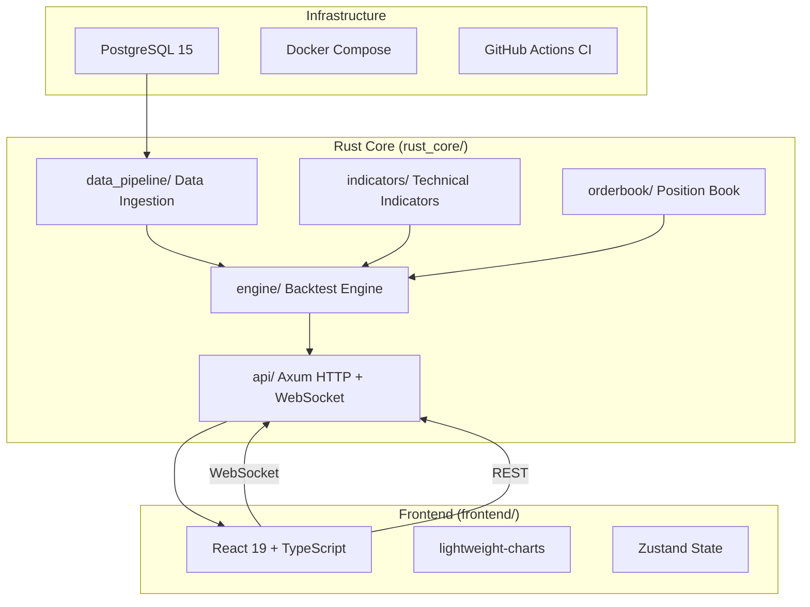

# CBT-Pro Architecture

## System Overview

CBT-Pro (Crypto Backtester Professional) is an institutional-grade cryptocurrency quantitative backtesting system with a hybrid architecture combining Rust performance, Python ergonomics, and TypeScript visualization.

## Architecture Diagram

## Module Responsibilities

### `data_pipeline/`
- Data ingestion from exchanges
- OHLCV storage in PostgreSQL
- Timeframe aggregation (M1 -> M5, M15, etc.)
- Parquet export/import

### `indicators/`
- Pure mathematical indicator calculations
- EMA, RSI, Bollinger Bands, MACD, ATR, VWAP
- No async, no I/O - deterministic math only

### `orderbook/`
- Position lifecycle management
- FIFO/LIFO/WeightedAverage cost basis
- Margin calculation and liquidation checks
- Order fill tracking

### `engine/`
- Bar-by-bar backtest execution
- Anti-data-leakage enforcement
- Execution delay handling
- Performance metrics calculation (Sharpe, drawdown, win rate)

### `api/`
- Axum HTTP REST API
- WebSocket gateway for real-time updates
- MsgPack serialization for efficiency

### `frontend/`
- React 19 + TypeScript 5.5
- Real-time chart visualization
- Playback controls (play/pause/step/speed)
- Signal and trade overlay markers

## Data Flow

1. **Data Ingestion**: `data_pipeline` loads historical OHLCV into PostgreSQL
2. **Backtest Start**: `api` receives config via POST `/backtest/start`
3. **Execution**: `engine` iterates bars, calls strategy callback, manages orders
4. **State Sync**: `engine` pushes `EngineSnapshot` via WebSocket
5. **Visualization**: `frontend` renders charts, positions, and signals

## Communication Contracts

All inter-module communication follows the interface contracts defined in SPEC.md Section 4:
- `BarStream` trait for data -> engine
- `OrderBookManager` trait for position operations
- `BacktestEngine` trait for execution control

## Technology Stack

| Layer | Technology |
|-------|-----------|
| Core Engine | Rust 2021, Tokio, Axum |
| Data Storage | PostgreSQL 15, SQLx |
| Serialization | Serde, Protocol Buffers |
| Math | rust_decimal |
| Frontend | React 19, TypeScript 5.5, Vite 6 |
| Charts | lightweight-charts |
| State | Zustand |
| CI/CD | GitHub Actions |
| Deployment | Docker Compose |
